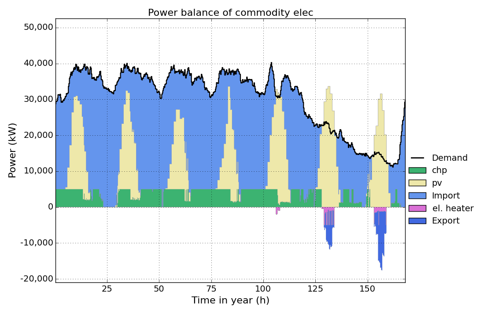
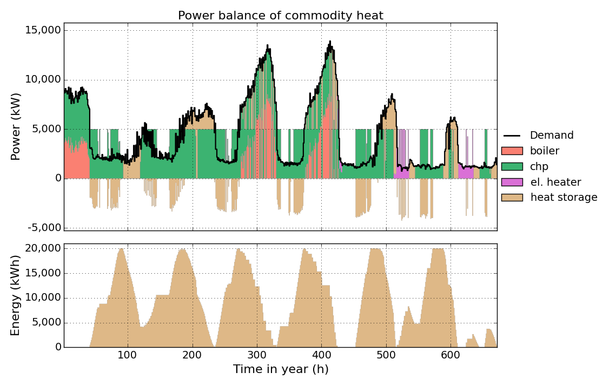
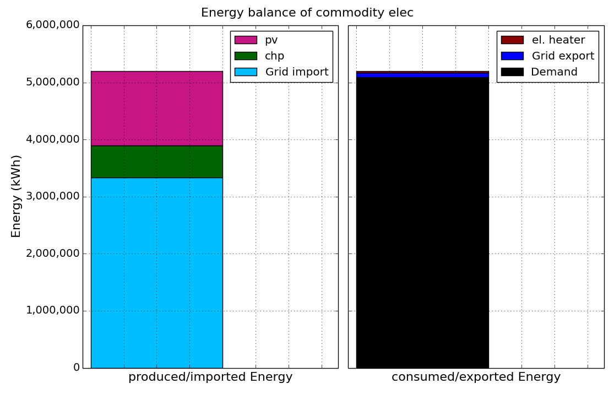
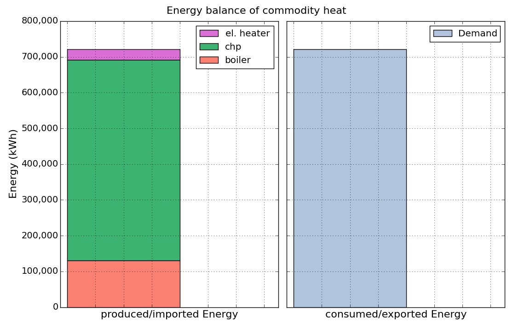
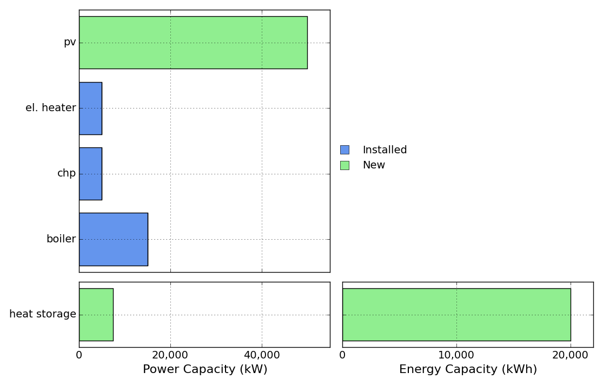
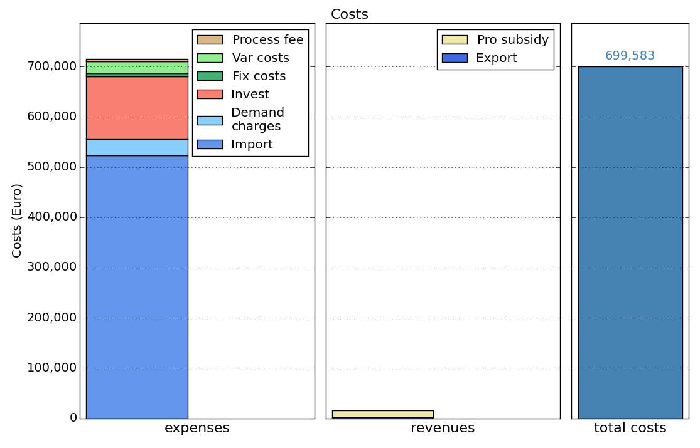

# ficus

ficus is a ([mixed integer](https://en.wikipedia.org/wiki/Integer_programming)) [linear programming](https://en.wikipedia.org/wiki/Linear_programming) optimisation model for capacity expansion planning and unit commitment for local energy systems. Referring to [URBS](https://github.com/tum-ens/urbs) and [VICUS](https://github.com/ojdo/vicus) it was developed as a model for optimisation energy systems of factories, but it can also be used for other energy consumers (e.g. households)

[](https://ficus.readthedocs.org/en/latest/)

<a href="doc/img/elec-timeseries.png"></a>

## Features

  * ficus is a (mixed integer) linear programming model for multi-commodity energy systems.
  * It finds the minimum cost energy system to satisfy given demand time-series for possibly multiple commodities (e.g. electricity, heat)
  * It considers given cost time-series for external obtained commodities as well as peak demand charges with configurable timebase for each commodity
  * It allows to deactivate specific equations, so the model becomes a linear programming model without integer variables
  * It supports multiple-input and multiple-output energy conversion technologies with load dependent efficiencies
  * Thanks to [Pandas](https://pandas.pydata.org), complex data analysis is easy.
  * The model itself is quite small thanks to relying on the [Pyomo](https://software.sandia.gov/trac/coopr/wiki/Pyomo) package and includes reporting and plotting functionality.


## Installation

### Windows

I recommend using the Python distribution Anaconda.  
**If you don't want to use Anaconda** or already have an existing Python 2.7 (sorry, 3.x is not yet supported) installation, you can also download the required packages one by one. Please follow the installation instructions of [urbs] (https://github.com/tum-ens/urbs) for a list of needed packages. Instead of "coopr" the package "pyomo" is needed for ficus.

#### Anaconda

  1. **[Anaconda (Python 2.7)](http://continuum.io/downloads)**. Choose the 64-bit installer if possible.
       1. During the installation procedure, keep both checkboxes "modify PATH" and "register Python" selected!

Install a [solver](#solver) or continue at [Get Started](#get-started).

### Linux

Use your Linux distribution's package manager to get all the packages listed in the Windows installation section. Below is the installation procedure for Ubuntu & Debian. Other distributions might have slightly different package names or differing procedures to get the individual packages to run:

  - **Everything** except Coopr & Excel I/O `sudo apt-get install python python-pip python-numpy python-scipy python-matplotlib ipython ipython-notebook python-pandas python-sympy python-nose glpk-utils`
  - **Coopr & Excel I/O** `sudo pip install pyomo xlwt xlrd openpyxl==1.8.6`

Continue at [Get Started](#get-started).

### Solver (optional)<a name="solver"></a>

Pyomo allows using the [NEOS Server for Optimisation](http://www.neos-server.org/neos/) for solving, so it is **not necessary to install a solver**.

I still recommend to install and use one of the following solvers.

  1. **GLPK** (open source)
       1. Download the latest version (e.g. GLPK-4.55) of [WinGLPK](http://sourceforge.net/projects/winglpk/files/winglpk/)
       2. Extract the contents to a folder, e.g. `C:\GLPK`
       3. Add the sub-folder `w64` to your system path, e.g. `C:\GLPK\w64` ([how](http://geekswithblogs.net/renso/archive/2009/10/21/how-to-set-the-windows-path-in-windows-7.aspx)).
  2. **CPLEX** (commercial)
  
       Download and install IBM's [CPLEX](http://www-01.ibm.com/software/commerce/optimization/cplex-optimizer/) solver. [Free for academics](https://www.ibm.com/developerworks/community/blogs/jfp/entry/cplex_studio_in_ibm_academic_initiative?lang=en)
  3. **Gurobi** (commercial)

       Download and install [Gurobi](http://www.gurobi.com/) solver. [Free for academics](http://www.gurobi.com/academia/for-universities)

### Git (optional)<a name="git-link"></a>

I recommend to [install git (for version control)](http://git-scm.com/). **Remark:** at step "Adjusting your PATH environment", select "Run Git from the Windows Command Prompt".

Then, in a directory of your choice, clone this repository by executing the following on the command prompt (Windows) or Terminal (Linux): 

    git clone https://github.com/yabata/ficus.git

## Get started

Once installation is complete, [download](https://github.com/yabata/ficus/archive/master.zip) or clone (with [Git](#git-link)) this repository to a directory of your choice.

### [Run from Excel](https://ficus.readthedocs.org/en/latest/tutorial.html#run-from-excel)
1. Run `ficus.py` (by double clicking or open with python). Continue with `y`. This will copy the `ficus.py` to `..\Lib\site-package` folder so python can find it and install pyomo if not yet installed.
2. Open the `example_fromexcel.xlsm`, choose a solver and push the `RUN OPTIMISATION` Button in the `RUN` Sheet.


### [Run from IPython](https://ficus.readthedocs.org/en/latest/tutorial.html#run-from-ipython)

1. Fire up IPython
2. Run `ficus.py` (only before using it the first time!):
  * Change ipython's working directory to the directory of `ficus.py`: 

  ```
    import os  
    os.chdir("C:\\YOUR\\FOLDER")  
  ```

   * Run the install function of `ficus.py` and continue with `y`. This will copy `ficus.py` to `..\Lib\site-package` folder so python can find it and install pyomo if not yet installed: 

  ```
    run ficus  
  ```

3. Run `runficus.py`:
  * Change ipython's working directory to the directory of `runficus.py`: 

  ```
    import os  
    os.chdir("C:\\YOUR\\FOLDER")  
  ```

  * Run `runficus.py`: 

  ```
    run ficus
  ```
 
### [Run from Spyder](https://ficus.readthedocs.org/en/latest/tutorial.html#run-from-spyder)

1. Fire up Spyder
2. Run `ficus.py` (only before using it the first time!):
  * Open `ficus.py` with Spyder
  * Run the script with `F5` and continue with `y`. This will copy `ficus.py` to `..\Lib\site-package` folder so python can find it and install pyomo if not yet installed.
3. Run the `runficus.py` script.
  * Open `runficus.py` with Spyder
  * Run the script with `F5`


About one minute after running ``runficus.py`` the result figures should show up and the sub-folder `result` should contain plots and a result file.


## Next steps

  1. Head over to the tutorial at http://ficus.readthedocs.org, which explains the input file.
  2. Quickly scan through `ficus.py`, read doc-strings.
  3. Try modifying parameters in `example.xlsx` or `example_fromexcel.xlsm` and see their effect on results.

 
## Screenshots

<a href="doc/img/elec-timeseries.png"></a>

<a href="doc/img/heat-timeseries.png"></a>

<a href="doc/img/elec-energy.png"></a>

<a href="doc/img/heat-energy.png"></a>

<a href="doc/img/capacities.png"></a>

<a href="doc/img/costs.png"></a> 
  
## Further reading

  - The book [Python for Data Analysis](http://shop.oreilly.com/product/0636920023784.do) best summarises the capabilities of the packages installed here. It starts with IPython, then adds NumPy, slowly fades to pandas and then shows first basic, then advanced data conversion and analysis recipes. Visualisation with matplotlib is given its own chapter, both with and without pandas.
  - For a huge buffet of appetizers showing the capabilities of Python for scientific computing, I recommend browsing this [gallery of interesting IPython Notebooks](https://github.com/ipython/ipython/wiki/A-gallery-of-interesting-IPython-Notebooks).
  
## Copyright

Copyright (C) 2015  Dennis Atabay

This program is free software: you can redistribute it and/or modify
it under the terms of the GNU General Public License as published by
the Free Software Foundation, either version 3 of the License, or
(at your option) any later version.

This program is distributed in the hope that it will be useful,
but WITHOUT ANY WARRANTY; without even the implied warranty of
MERCHANTABILITY or FITNESS FOR A PARTICULAR PURPOSE.  See the
GNU General Public License for more details.

You should have received a copy of the GNU General Public License
along with this program.  If not, see <http://www.gnu.org/licenses/>
